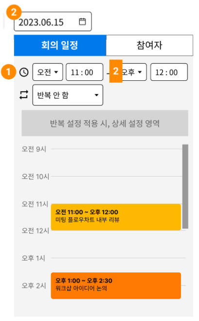

# calendar

* 룸 일정 조회
  * 룸 & 날짜 & meeting = true -> 일정 조회
  * _event id -> meeting id 및 미팅 내용 조회 (MEETING SAS)_

.png>).png>)

* 룸 일정 조회(meeting = true) + 미팅 내용 조회
  * 날짜 & meeting = true -> 일정 조회
  * _event id -> meeting id 및 미팅 내용 조회 (MEETING SAS)_

.png>)

***

* WAPL calendar 일정 등록 플로우
  *   새 일정 등록

      * 제목, 날짜, 반복설정, meeting 유무, 구성원(초대. 방생성은  안됨), 장소, 캘린더 종류, 표시할 색, 알림, 첨부파일, 설명

      .png>)
  *   반복 설정

      * id : 일정 id
      * originalCalendarId : 일정 parents  id(?)
      * title : 제목
      * start : 일정 시작
      * end : 일정 종료
      * rrule : 반복 설정(null)
      * repeatEndDate : 반복 종료(?)

      
  * 반복 설정 "모든 일정" 수정
    * id 동일
    * originalCalendarId 동일
  * 반복 설정 "이 일정 및 향후 일정" 수정
    * 반복 일정 중 첫 일정을 선택할 경우
      * "모든 일정"과 동일하게 수정
    * 그 외
      * id 새로 생성
      * originalCalendarId 동일
  * 반복 설정 "이 일정만"  수정
    * id 새로 생성
    * originalCalendarId 동일
  * 반복 설정 "이 일정만" 수정 "이 일정만" 재수정
    * id 새로 생성
    * originalCalendarId 동일
    * 이전 일정 rrule에 EXDATE 추가. 일정은 있으나, 과거로 설정하여 calendar 상에 표시가 안됨.
  * 조회
    * 조회 시작\~종료
    * event?start\&end
